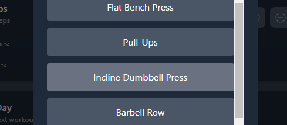
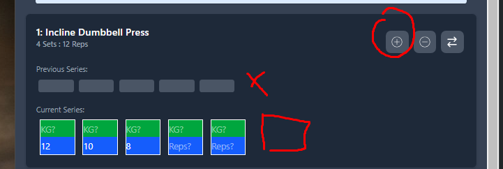

notepad

session -> completedProgramDaysHistory
session exports: plannedExercise
completedProgramDaysHistory expects: DayHistory

------------------------------------------------------------------------------------
## /Builder

delete:
drizzle.config.ts
hooks.server.ts
lib/server->
auth.ts
index.ts
schema.ts

check -> dayhistory.ts , exerciseHistory.ts

selected but still grey on hover - should be green

adding set, shouldnt add to 'previous series'

-------------------
# Todo

## Fix existing structure

    {#each $personalProgram.exercises as plannedExercise, index}
  {@const exercise = lookupExerciseById(plannedExercise.exerciseId)}
  {index + 1}: {exercise?.name ?? 'Unknown exercise'}
{/each}

-----REVIEW THE FLUSHED DATA IN SOME UI THINGY----
-----REVIEW THE FLUSHED DATA IN SOME UI THINGY----
-----REVIEW THE FLUSHED DATA IN SOME UI THINGY----
-----REVIEW THE FLUSHED DATA IN SOME UI THINGY----

<!-- - [x] Replace `ExerciseHistory.exercise` with `exerciseId: number`
- [x] Update all usages of `ExerciseHistory` accordingly
- [x] Add `sessionId: string` to:
  - `ExerciseHistoryEntry`
  - `DayHistory`

- [ ] Clean up any leftover circular refs or stale types -->

<!-- ## Add new features

- [ ] `flushSessionToHistory()`:

  - [ ] Generate `sessionId` (uuid)
  - [ ] Push full day to `completedProgramDaysHistory`
  - [ ] Push each exercise to `exerciseHistory` using same `sessionId`

- [ ] `updateSetInHistory({ exerciseId, sessionId, setNumber, newData })`:

  - [ ] Edit the matching set in both stores

## Optional (later)

- [ ] Derive `exerciseHistory` from `completedProgramDaysHistory`
- [ ] Add UI for editing past sessions
- [ ] Add import/export for backup\
- [ ] `deleteSession(sessionId)`:
 -->

